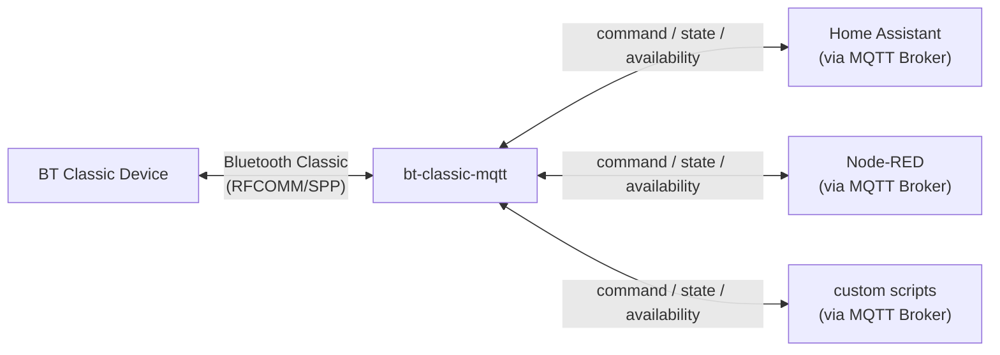

# bt-classic-mqtt

[](https://github.com/magarage/bt-classic-mqtt/actions/workflows/build.yml)
[](LICENSE)
[](https://www.python.org/downloads/)

Bridges Bluetooth Classic (SPP/RFCOMM) devices to MQTT.

Control any BT Classic device that uses a serial command protocol — soundbars, printers, OBD-II adapters, industrial equipment — from any MQTT-capable system.



> **Why this exists**: BT Classic SPP devices are not supported by existing BT-MQTT bridges (bt-mqtt-gateway, OpenMQTTGateway, Theengs) which are all BLE-only. This project fills that gap.

---

## How it works

Each device is defined by a **`model.yaml`** file. No Python code needed for most devices.

```yaml
# models/my-device/model.yaml
device_id: my-device

packet:
  sync: "ccaa"
  checksum: negate_sum

commands:
  POWER_ON:  { payload: "40787e" }
  VOLUME_UP: { payload: "40781e", followup: VOLUME }

state_packets:
  0x05:
    fields:
      power:  { offset: 2, type: bool, true_value: 0x01 }
      volume: { offset: 5, type: int }
```

The core engine handles RFCOMM connection, packet framing, stream decoding, MQTT pub/sub, and HA Discovery automatically — driven entirely by the YAML definition.

---

## Quick Start

**Prerequisites**: Host with Bluetooth Classic adapter, Docker, MQTT broker.

```bash
git clone https://github.com/magarage/bt-classic-mqtt.git
cd bt-classic-mqtt
cp .env.example .env
nano .env
```

`.env`:
```
BT_MAC=<YOUR_DEVICE_MAC>
CONFIG=devices/yamaha-yas-207/model.yaml
MQTT_HOST=<YOUR_MQTT_HOST>
MQTT_PORT=1883
MQTT_USERNAME=
MQTT_PASSWORD=
LOG_LEVEL=INFO
```

```bash
docker compose pull
docker compose up -d
docker compose logs -f
```

---

## MQTT API

### State topic: `{model_id}/state`

Published whenever device state changes.

```json
{
  "power": true,
  "input": "Bluetooth",
  "sound_mode": "Music",
  "volume": 46,
  "muted": false
}
```

### Command topic: `{model_id}/command`

Multiple keys can be sent in a single payload.

```bash
# Single command
mosquitto_pub -h localhost -t yamaha-yas-207/command -m '{"power": true}'

# Multiple keys at once
mosquitto_pub -h localhost -t yamaha-yas-207/command \
  -m '{"input": "Bluetooth", "sound_mode": "Music"}'

# Direct command
mosquitto_pub -h localhost -t yamaha-yas-207/command \
  -m '{"command": "VOLUME_UP"}'
```

### Availability topic: `{model_id}/availability`

`online` / `offline`. Reconnects on-demand when a command arrives.

---

## Supported Models

| Model | Directory | Notes |
|---|---|---|
| Yamaha YAS-207 | [`models/yamaha-yas-207`](src/bt_classic_mqtt/models/yamaha-yas-207/) | Soundbar — full control via SPP |

---

## Adding a New Model

### 1. Create the device directory

```bash
mkdir devices/my-device
```

### 2. Create `model.yaml`

```yaml
device_id: my-device
mqtt_topic_prefix: my-device   # MQTT topic prefix (defaults to model_id)

device_name: My Device
device_model: Model XYZ
device_manufacturer: Acme

# Bluetooth handshake — packets sent on initial connect
connection:
  init_sequence:
    - "hex_payload_here"

# Packet framing
packet:
  sync: "ccaa"            # Frame start bytes
  checksum: negate_sum     # Built-in: yamaha_v1 | xor8 | none

# Commands
commands:
  POWER_ON:  { payload: "hex" }
  POWER_OFF: { payload: "hex" }
  VOLUME_UP: { payload: "hex", followup: VOLUME }  # followup requests state update

# Followup payloads (sent after command to request partial state)
followups:
  VOLUME: "hex"

# Value maps
maps:
  input_sources:
    0x00: HDMI
    0x05: Bluetooth

# State packet parsing
# Field types: bool | int | map | map_word_be | bitmask
state_packets:
  0x05:
    min_length: 6
    fields:
      power:   { offset: 2, type: bool,  true_value: 0x01 }
      volume:  { offset: 5, type: int }
      input:   { offset: 3, type: map,   map: input_sources }

# MQTT command → packet mapping
mqtt_commands:
  state:
    on:  POWER_ON
    off: POWER_OFF
  source:
    map: input_sources
    prefix: INPUT_
  command: direct

# Home Assistant MQTT Discovery (optional)
ha_discovery:
  switches:
    - { name: Power, field: power, on_cmd: POWER_ON, off_cmd: POWER_OFF, icon: mdi:power }
  sensors:
    - { name: Volume, field: volume, icon: mdi:volume-high }
```

### 3. Run

```bash
CONFIG=devices/my-device/model.yaml BT_MAC=<MAC> MQTT_HOST=<HOST> docker compose up
```

### Need custom packet framing?

If your device uses a non-standard framing or checksum not covered by the built-in
checksum algorithms, add a `protocol.py` alongside `model.yaml`:

```python
# devices/my-device/protocol.py
from bt_classic_mqtt.core.yaml_model import YamlSpeakerModel

class MyDeviceModel(YamlSpeakerModel):
    def encode(self, payload: bytes) -> bytes:
        # custom framing
        ...

    def decode_stream(self, data: bytes) -> tuple[list[bytes], bytes]:
        # custom stream parsing
        ...

MODEL_CLASS = MyDeviceModel
```

The loader detects `protocol.py` automatically — no registration needed.

---

## Home Assistant Integration

HA MQTT Discovery is built in. Once running, the device appears automatically under Settings → Devices & Services → MQTT.

For a full HA setup example, see the [Yamaha YAS-207 README](src/bt_classic_mqtt/models/yamaha-yas-207/README.md).

---

## Environment Variables

| Variable | Required | Default | Description |
|---|---|---|---|
| `BT_MAC` | ✅ | — | Bluetooth MAC address of the device |
| `CONFIG` | ✅ | — | Model ID, e.g. `yamaha-yas-207` |
| `MQTT_HOST` | ✅ | — | MQTT broker host |
| `MQTT_PORT` | | 1883 | MQTT broker port |
| `MQTT_USERNAME` | | — | MQTT username |
| `MQTT_PASSWORD` | | — | MQTT password |
| `LOG_LEVEL` | | INFO | DEBUG / INFO / WARNING |

---

## CI/CD

| Trigger | Image tag |
|---|---|
| Push to `main` | `:latest` |
| Push tag `v1.2.3` | `:1.2.3`, `:1.2`, `:latest` |
| Pull request | Build only (no push) |

Images built for `linux/arm64` (Raspberry Pi 4/5).

---

## Project Structure

```
bt-classic-mqtt/
  src/bt_classic_mqtt/     # Core engine — device-agnostic
    bt/
      connection.py        # RFCOMM socket
    mqtt/
      client.py            # paho-mqtt wrapper
    model.py               # DeviceModel ABC, DeviceState
    yaml_model.py          # YAML-driven generic implementation
    controller.py          # MQTT bridge engine
    main.py                # Entry point
  devices/                 # Device definitions — YAML + docs, no Python required
    yamaha-yas-207/
      model.yaml           # Full device definition
      README.md            # Device-specific setup guide
  docs/
    airplay.md             # AirPlay + shairport-sync integration guide
  scripts/
    airplay-start.sh       # Generic AirPlay hook script (device-agnostic)
```

---

## Known Limitations

- **BT Classic (RFCOMM/SPP) only** — not BLE
- **Single SPP connection** — only one client at a time; official apps will conflict
- **On-demand reconnect** — bridge stays offline until a command arrives, allowing the device's idle timer to turn it off naturally