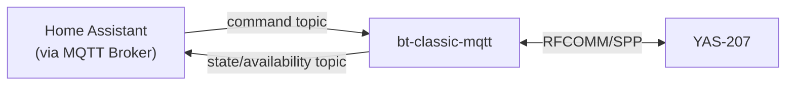
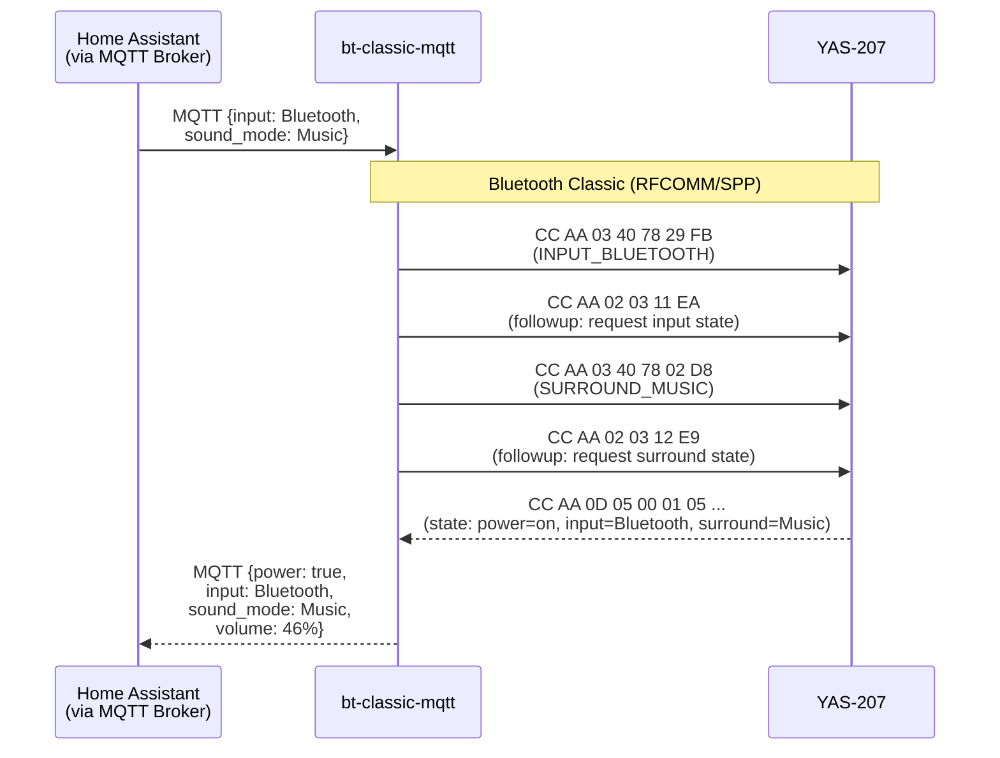

# Yamaha YAS-207

bt-classic-mqtt model for the Yamaha YAS-207 soundbar.

Controls power, input source, volume, EQ, subwoofer, mute, bass extension, and clear voice via Bluetooth SPP. Includes full Home Assistant MQTT Discovery support.

---

## How it works



---

## Detailed flow



---

## Quick Start

```bash
BT_MAC=<YOUR_SOUNDBAR_MAC> \
MODEL=yamaha-yas-207 \
MQTT_HOST=<YOUR_MQTT_HOST> \
docker compose up -d
```

---

## MQTT API

### State: `yamaha-yas-207/state`

```json
{
  "power": true,
  "input": "Bluetooth",
  "sound_mode": "Music",
  "volume": 46,
  "muted": false,
  "subwoofer": 8,
  "bass_ext": false,
  "clearvoice": true
}
```

### Commands: `yamaha-yas-207/command`

Multiple keys can be combined in one payload.

| Key | Values |
|---|---|
| `power` | `true` / `false` |
| `input` | `"HDMI"` / `"TV"` / `"Analog"` / `"Bluetooth"` |
| `sound_mode` | `"Movie"` / `"Music"` / `"Sports"` / `"Game"` / `"Stereo"` / `"3D"` / `"TV Program"` |
| `muted` | `true` / `false` |
| `command` | `"VOLUME_UP"` / `"VOLUME_DOWN"` / `"SUBWOOFER_UP"` / `"SUBWOOFER_DOWN"` |

```bash
# Power on and switch to Bluetooth with Music mode
mosquitto_pub -h localhost -t yamaha-yas-207/command \
  -m '{"power": true, "input": "Bluetooth", "sound_mode": "Music"}'

# Volume up
mosquitto_pub -h localhost -t yamaha-yas-207/command -m '{"command": "VOLUME_UP"}'
```

---

## Home Assistant

HA MQTT Discovery is built in. Once bt-classic-mqtt is running, a **Yamaha YAS-207** device appears automatically under Settings → Devices & Services → MQTT.

### Entities

| Entity | Type |
|---|---|
| Power | switch |
| Mute | switch |
| Bass Extension | switch |
| Clear Voice | switch |
| Input Source | select |
| Sound Mode | select |
| Volume Up / Down | button |
| Subwoofer Up / Down | button |
| Volume | sensor |
| Subwoofer Level | sensor |

### Dashboard card

```yaml
type: entities
title: YAS-207
entities:
  - entity: switch.power
  - entity: select.input_source
  - entity: select.sound_mode
  - entity: switch.mute
  - entity: button.volume_up
  - entity: button.volume_down
  - entity: sensor.volume
  - entity: switch.bass_extension
  - entity: switch.clear_voice
  - entity: button.subwoofer_up
  - entity: button.subwoofer_down
  - entity: sensor.subwoofer_level
```


---

## AirPlay Integration (optional)

> See [docs/airplay.md](../../docs/airplay.md) for the full setup guide.

Set `MQTT_COMMAND` to switch the YAS-207 to Bluetooth input and Music mode when AirPlay begins:

```bash
# /etc/default/shairport-sync
BT_MAC=<YOUR_SOUNDBAR_MAC>
MQTT_HOST=<YOUR_MQTT_HOST>
MQTT_TOPIC=yamaha-yas-207/command
MQTT_COMMAND={"input": "Bluetooth", "sound_mode": "Music"}
```


---

## Known Limitations

- **Single SPP connection** — the official Yamaha HT Controller app will conflict if connected simultaneously
- **No direct volume set** — volume is Up/Down only; no set-to-value command in the SPP protocol
- **Input auto-switch** — connecting via A2DP causes the soundbar to switch input to Bluetooth automatically (firmware behaviour)

---

## Protocol Reference

Reverse-engineered by Michal Jirku: [wejn.org](https://wejn.org/2021/11/making-yamaha-yas-207-do-what-i-want/)
Ruby reference: [wejn/yamaha-yas-207](https://github.com/wejn/yamaha-yas-207)