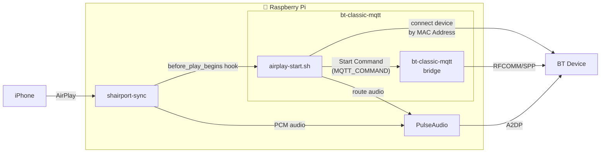
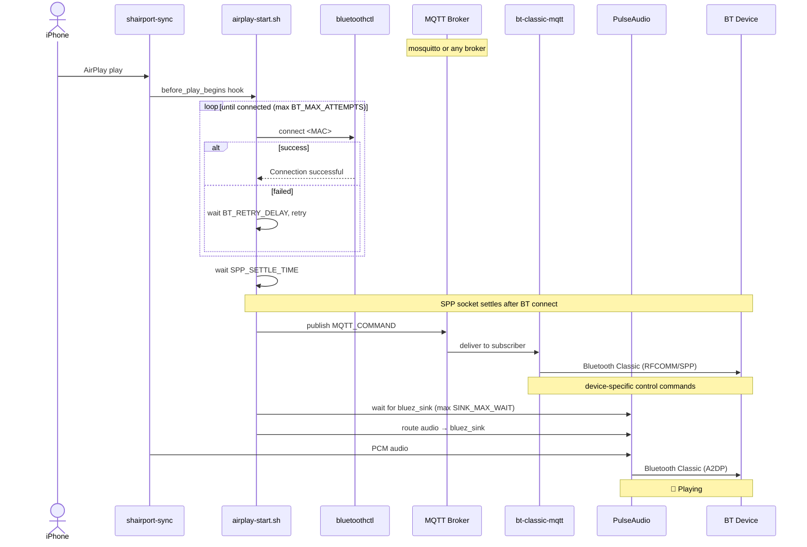

# AirPlay Integration with shairport-sync

This guide explains how to set up iPhone → AirPlay → Raspberry Pi → Bluetooth A2DP audio, and trigger bt-classic-mqtt commands automatically when playback begins.

> This setup is host-level (not Docker). It runs on the Raspberry Pi alongside bt-classic-mqtt.

---

## How it works



---

## Prerequisites

```bash
sudo apt update
sudo apt install -y \
    pulseaudio \
    pulseaudio-module-bluetooth \
    shairport-sync \
    mosquitto-clients \
    bluez
```

---

## Setup

### 1. Pair your BT device

```bash
bluetoothctl
> power on
> scan on
> pair <YOUR_DEVICE_MAC>
> trust <YOUR_DEVICE_MAC>
> exit
```

### 2. PulseAudio null sink

Keeps shairport-sync alive when the BT device is off.

```bash
sudo nano /etc/pulse/default.pa
```

Append:
```
load-module module-null-sink sink_name=virtual_out sink_properties=device.description=Virtual
load-module module-loopback source=virtual_out.monitor
```

```bash
pulseaudio --kill && pulseaudio --start
pactl list sinks short   # virtual_out should appear
```

### 3. Configure shairport-sync

```bash
sudo nano /etc/shairport-sync.conf
```

```conf
general = {
    name = "My Speaker";
    output_backend = "pa";
};

sessioncontrol = {
    run_this_before_play_begins = "/usr/local/bin/airplay-start";
};

pa = {
    sink = "virtual_out";
};
```

### 4. Install airplay-start.sh

```bash
sudo cp scripts/airplay-start.sh /usr/local/bin/airplay-start
sudo chmod +x /usr/local/bin/airplay-start
```

### 5. Configure environment variables

Add to `/etc/default/shairport-sync`:

```bash
sudo nano /etc/default/shairport-sync
```

```
# Required
BT_MAC=<YOUR_DEVICE_MAC>
MQTT_HOST=<YOUR_MQTT_HOST>

# Optional — defaults shown
MQTT_PORT=1883
MQTT_USERNAME=
MQTT_PASSWORD=
MQTT_TOPIC=bt-classic-mqtt/command
MQTT_COMMAND={"power": true}
```

**Device-specific `MQTT_COMMAND` examples:**

```bash
# Yamaha YAS-207 — switch to Bluetooth input and set Music mode
MQTT_COMMAND={"input": "Bluetooth", "sound_mode": "Music"}

# Generic — just power on
MQTT_COMMAND={"power": true}
```

### 6. Run shairport-sync as a user service

```bash
sudo systemctl stop shairport-sync
sudo systemctl disable shairport-sync

mkdir -p ~/.config/systemd/user/
cp /lib/systemd/system/shairport-sync.service ~/.config/systemd/user/
nano ~/.config/systemd/user/shairport-sync.service
```

`[Unit]`:
```ini
After=sound.target network.target network-online.target
```

`[Service]` — comment out `User=` and `Group=`:
```ini
#User=shairport-sync
#Group=shairport-sync
```

`[Install]`:
```ini
WantedBy=default.target
```

```bash
systemctl --user daemon-reload
systemctl --user enable --now shairport-sync
sudo loginctl enable-linger $USER
```


---

## Detailed flow



---

## Troubleshooting

**`mosquitto_pub` fails** — try `MQTT_HOST=127.0.0.1` instead of `localhost`.

**bluez_sink doesn't appear** — increase `SINK_MAX_WAIT` or check `pactl list sinks short`.

**BT connect fails repeatedly** — verify the device is powered on and trusted: `bluetoothctl info <MAC>`.

**WiFi + BT instability (Pi Zero 2W / Pi 3)** — the BCM43438 chip shares the WiFi/BT antenna. Use a USB Bluetooth dongle and disable the built-in BT:
```bash
# /boot/config.txt
dtoverlay=disable-bt
```